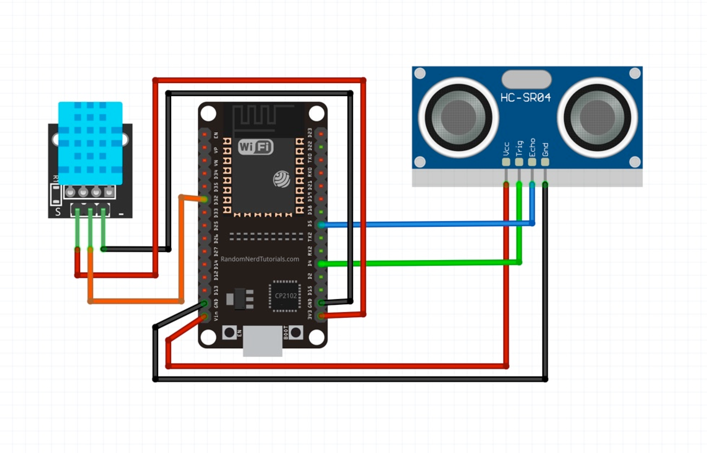

# (WIP) Sourdough starter monitoring with Grafana stack

The Sourdough starter monitoring system helps you make more data driven decisions when it comes to your bread making. It monitors your sourdough starter’s height, temperature, and humidity, and sends data straight to Grafana Cloud's Loki and Prometheus. You can then visualise your data in Grafana's dashboard and set up alerts that will notify you when is the best time to feed your starter.

This project was part of **[GrafanaCONline 2021 Easy DIY IoT projects with Grafana](https://grafana.com/go/grafanaconline/2021/diy-iot/)** session.

## Hardware

To build this system, you will need:

- **1 [DHT11](https://components101.com/sensors/dht11-temperature-sensor)** sensor to measure temperature and humidity
- **1 [HC-SR04](https://components101.com/sensors/ultrasonic-sensor-working-pinout-datasheet)** ultrasonic distance sensor
- **1 [ESP32 DEVKIT DOIT](https://randomnerdtutorials.com/getting-started-with-esp32/)** development board
- **7 F-F Dupont cables**
- **1 micro USB cable**
- **1 USB charger**

Plus:
- **1 jar** for your sourdough starter, with a lid you can cut

## Libraries:

- **DHT sensor library by** Adafruit
- **Adafruit Unified Sensor** by Adafruit
- **NTP Client** by Fabrice Weinberg
- **HCSR04** by Martin Sosic
- **Loki** *needs to be added*
- **Prometheus/Cortex** *needs to be added*

## Circuit & Wiring diagrams

## Data storage and visualisation

We are using free tier of [Grafana Cloud](https://grafana.com/products/cloud/) that comes with hosted [Loki](https://grafana.com/oss/loki/) (logs), [Prometheus](https://grafana.com/oss/prometheus/) (metrics) and [Grafana](https://grafana.com/oss/grafana/) (visualisation). As soon as your account is all set up, you can see the portal with the hosted Grafana, Loki, and Prometheus instances. Created API keys for Loki and Prometheus to publish metrics from the monitoring system to these databases. Update API keys in the config file.

 

