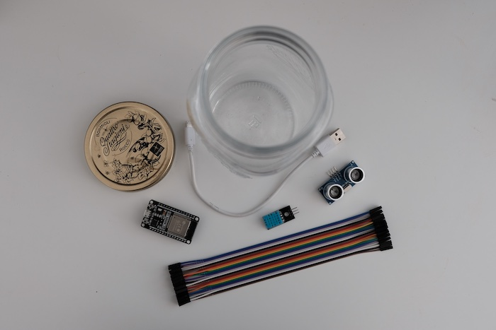
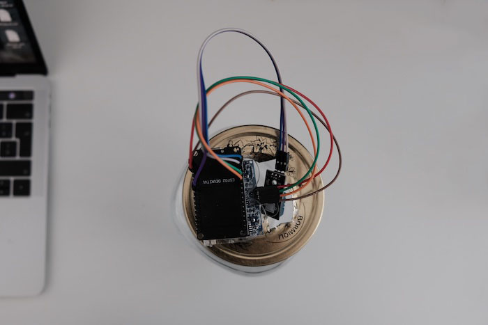

# Sourdough starter monitoring with Arduino and Grafana

The Sourdough starter monitoring system helps you make more data driven decisions when it comes to your bread making. It monitors your sourdough starter’s height, temperature, and humidity, and sends data straight to Grafana Cloud's Loki and Prometheus. You can then visualise your data in Grafana's dashboard and set up alerts that will notify you when is the best time to feed your starter.

This project was part of **[GrafanaCONline 2021 Easy DIY IoT projects with Grafana](https://grafana.com/go/grafanaconline/2021/diy-iot/)** session. You can also read blog post on [How to monitor a sourdough starter with Prometheus and Grafana Cloud](https://grafana.com/blog/2022/06/09/how-to-monitor-a-sourdough-starter-with-prometheus-and-grafana-cloud/).

## Arduino & Grafana

To start, review and follow steps in the **[Grafana DIY IoT repo](https://github.com/grafana/diy-iot)**.

## Hardware

To build this system, you will need:

- **1 [DHT11](https://components101.com/sensors/dht11-temperature-sensor)** sensor to measure temperature and humidity
- **1 [HC-SR04](https://components101.com/sensors/ultrasonic-sensor-working-pinout-datasheet)** ultrasonic distance sensor
- **1 [ESP32 DEVKIT DOIT](https://randomnerdtutorials.com/getting-started-with-esp32/)** development board
- **7 F-F Dupont cables**
- **1 micro USB cable**
- **1 USB charger**

Plus:

- **1 jar** for your sourdough starter, with a lid you can cut

## Libraries:

- **DHT sensor library by** Adafruit
- **HCSR04** by Martin Sosic
- **Adafruit Unified Sensor** by Adafruit
- **ArduinoBearSSL** by Arduino
- **ArduinoHttpClient** by Arduino
- **PrometheusArduino** by Ed Welch
- **PromLokiTransport** by Ed Welch
- **SnappyProto** by Ed Welch

## Circuit & Wiring diagrams

## Software

Download this repo that includes the software for sourdough monitoring. Update config.h file with your names, passwords and API keys. Upload software to your board using Arduino IDE.

